**ROS2 3일차 과제 1 보고서**  
예비단원 김민찬

1. **topic hz 확인**: 
   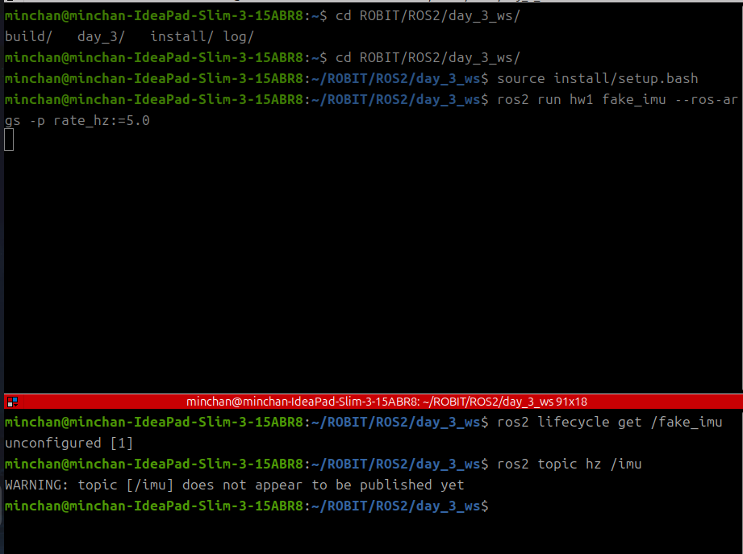
   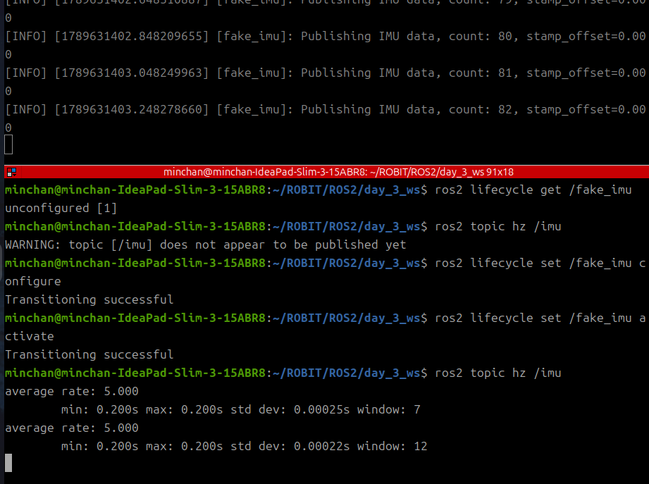
   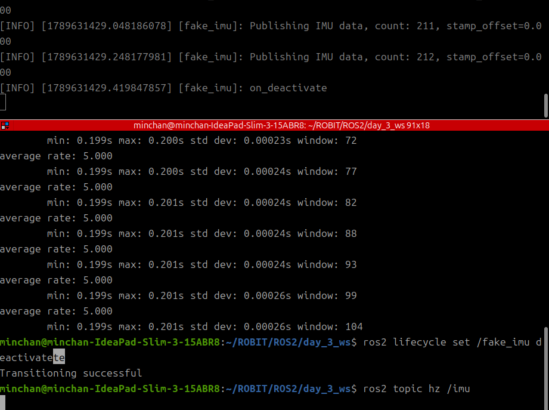
   `fake_imu`를 `rate_hz:=5.0`으로 activate하니 `ros2 topic hz /imu` 결과 평균 5.000Hz로 정확히 발행됨을 확인했다. configure 전에는 `/imu`가 발행되지 않는 것도 함께 확인했다.

2. **FAILURE 검증**:
   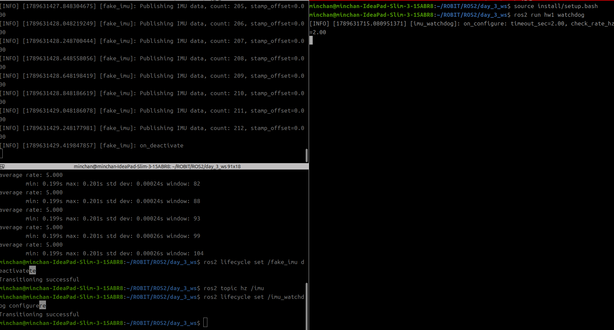
   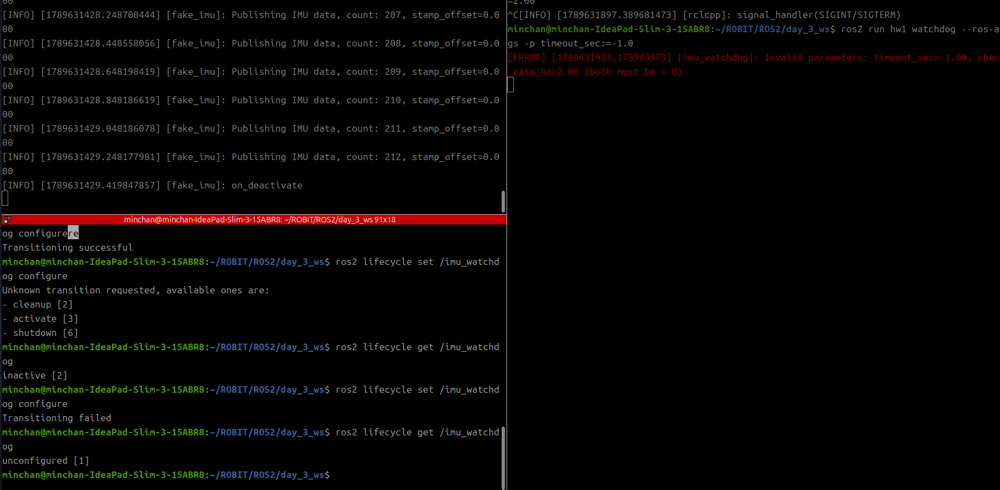
   `timeout_sec:=-1.0`으로 실행 시 `on_configure`에서 파라미터 검증에 걸려 `[ERROR] Invalid parameters`가 출력되고 `Transitioning failed`로 configure가 거부됨을 확인했다. 이후 `ros2 lifecycle get`으로 상태가 `unconfigured`에 그대로 머무는 것도 확인했다.

3. **실시간 연동**:
   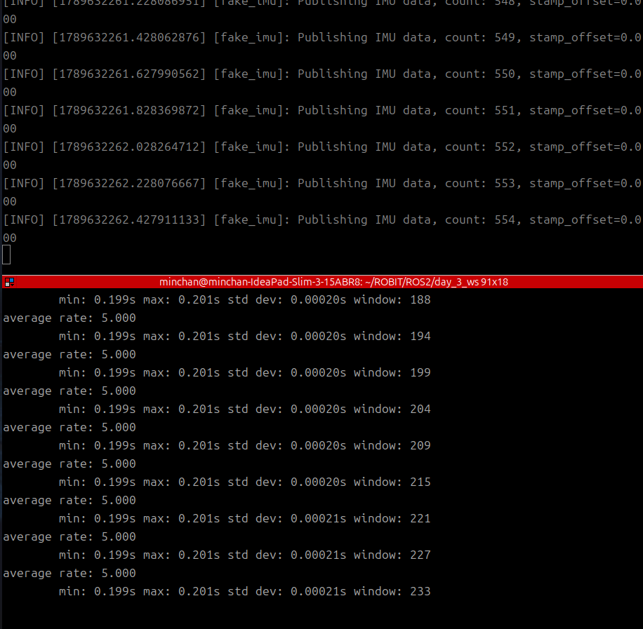
   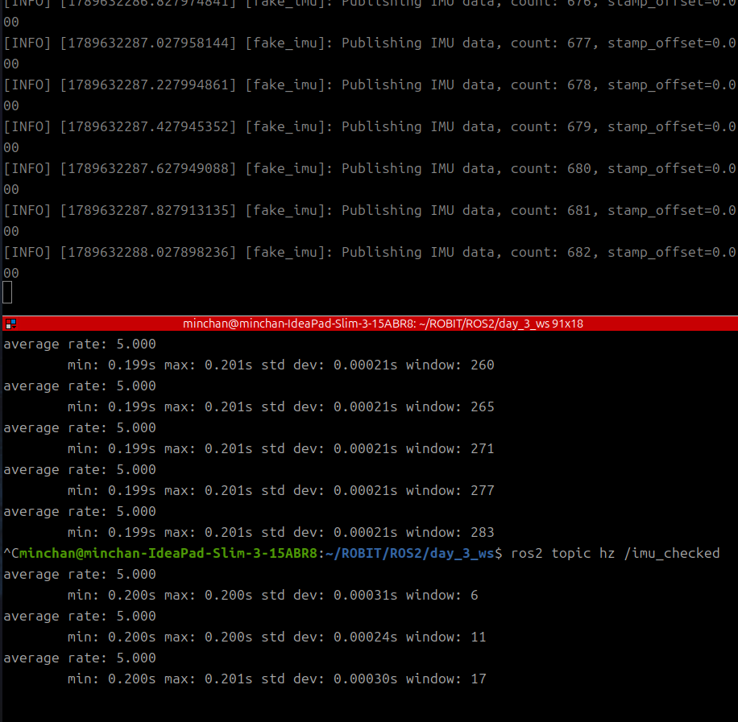
   `fake_imu`와 `imu_watchdog`을 모두 activate한 뒤 `ros2 topic hz /imu_checked`를 확인하니 `/imu`와 동일한 5Hz로 재발행되고 있었다. watchdog이 정상 데이터를 지연 없이 필터링·중계함을 확인했다.

4. **고장 재현**:
   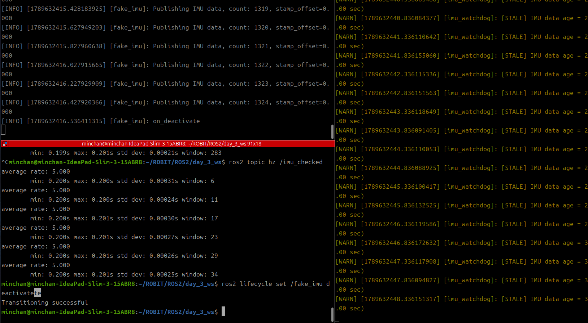
   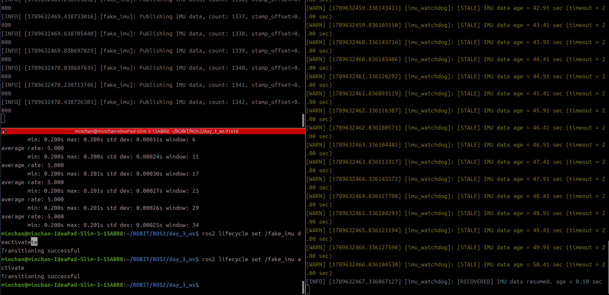
   `ros2 lifecycle set /fake_imu deactivate`로 발행을 끊자 watchdog이 `timeout_sec`(2초) 경과 후 `[STALE]` 경고를 반복 출력했고, 다시 activate하자 `[RECOVERED]` 로그가 한 번 출력됐다.

5. **bag 녹화**:
   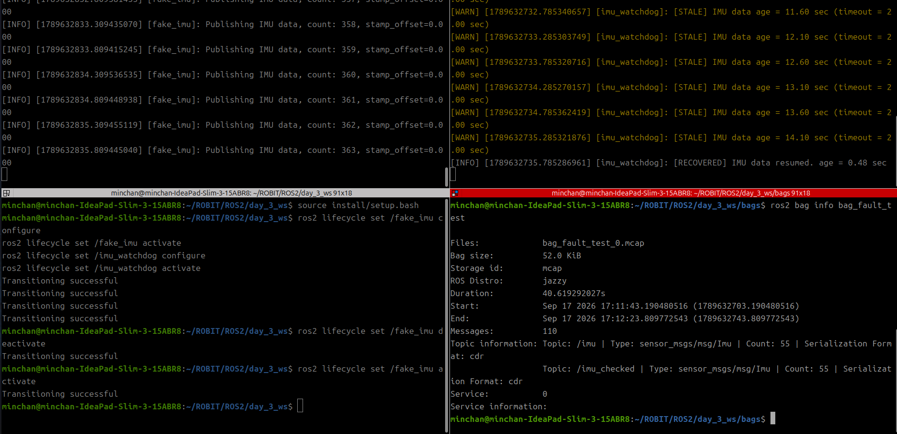
   deactivate/activate로 고장을 재현하며 `/imu`, `/imu_checked`를 녹화한 결과 `ros2 bag info`에서 두 토픽 모두 55개로 동일한 메시지 수를 확인했다. 40초 구간 대비 메시지 수가 적어 공백 구간이 정상적으로 기록됐음을 확인했다.

6. **sim time 재생 (일시정지/2배속)**:
   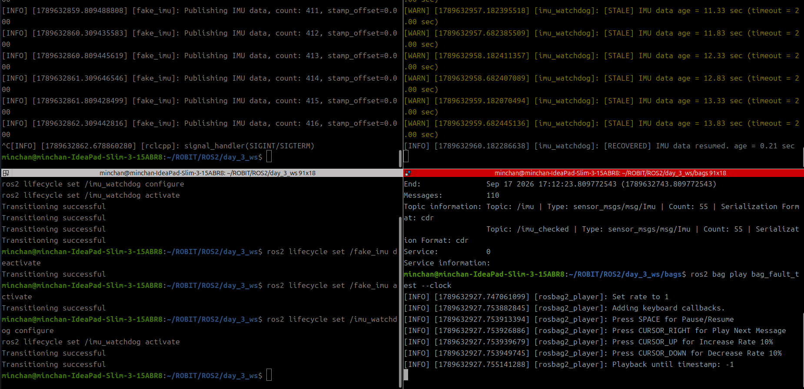
   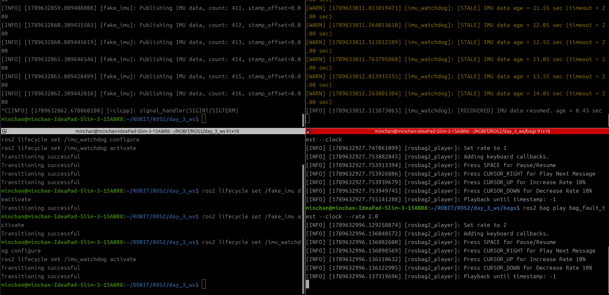
   `ros2 bag play --clock`으로 재생하니 watchdog의 STALE→RECOVERED 패턴이 녹화 당시와 동일하게 재현됐고, `--rate 2.0` 재생 시에도 같은 age 패턴이 벽시계 기준 절반 시간에 재현됨을 확인했다.

7. **wall timer 비교**:
    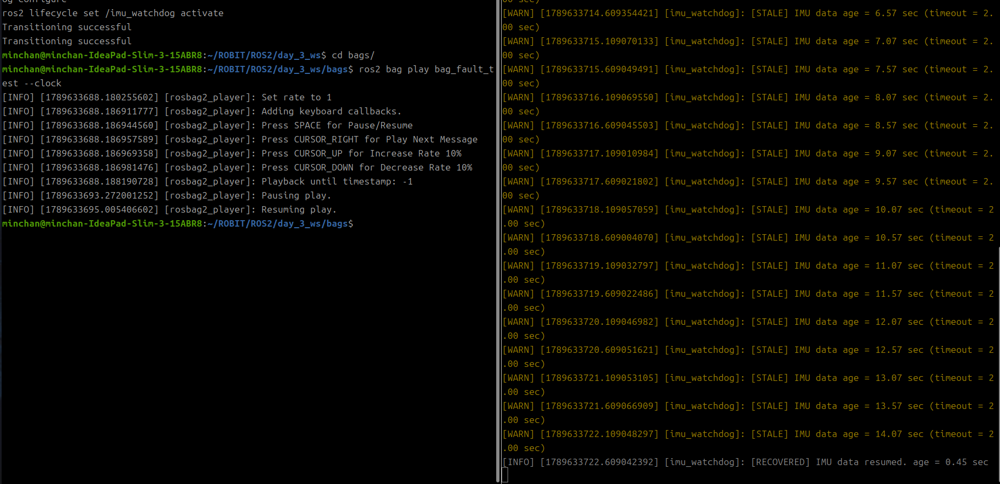
   `check_timer_`를 `create_wall_timer`로 바꾸니 bag pause 중에도 콜백이 계속 벽시계 주기로 호출됐지만, `this->now()`가 sim time이라 로그 속 age 값은 고정된 채 반복 출력됐다. `create_timer` 버전에서는 pause 시 콜백 자체가 멈췄던 것과 대비된다.

8. **launch**:
    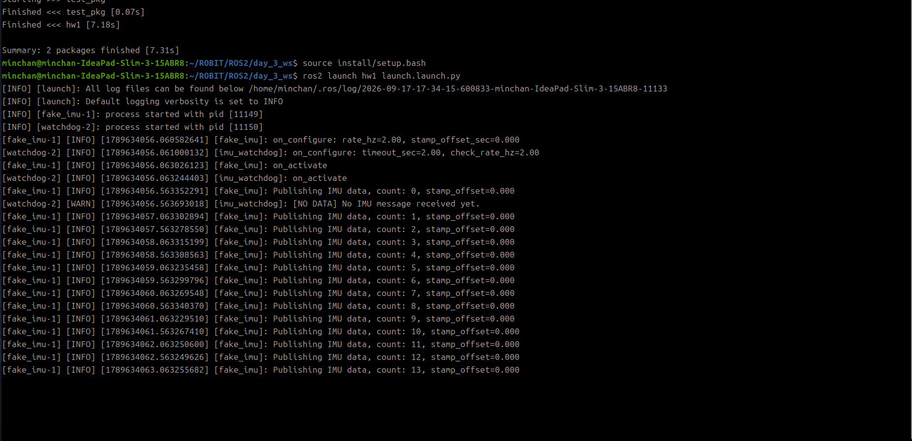
   `ros2 launch hw1 launch.launch.py` 실행 한 번으로 `fake_imu`, `imu_watchdog` 두 노드가 각각 configure→activate까지 자동 전이되고, 곧바로 `/imu` 발행과 watchdog 감시가 시작됨을 확인했다.
