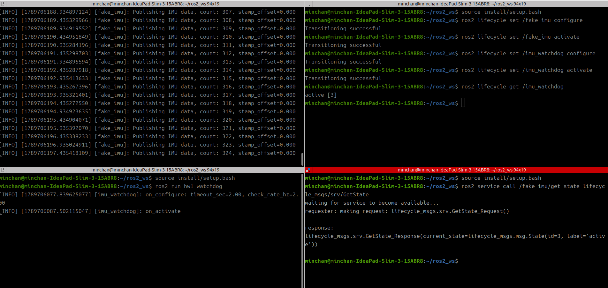

**ROS2 4일차 과제1 보고서**
예비단원 김민찬

### 1. 블로킹 구현 (의도적 실패)
`future.get()`으로 서비스 응답을 블로킹 대기하도록 구현하니, `on_activate` 이후 모든 로그와 `ros2 lifecycle get /imu_watchdog` 응답이 완전히 멈췄다. SingleThreadedExecutor의 유일한 스레드가 응답 대기에 갇혀 스스로를 막는 데드락이 원인이다.

[2-1.mp4](https://github.com/mck737338/Robit_intelligence_ros2/blob/408c4e95311cd1b6a86aca9b76bde0356087a101/day_4/hw1/video/2-1.mp4)

### 2. 비동기 수정
`async_send_request(request, 콜백)`으로 바꾸자 `fake_imu state: active` 로그가 1초 간격으로 정상 출력되고, `ros2 lifecycle get`도 즉시 응답했다. 요청 전송과 응답 처리가 분리되어 executor 스레드를 막지 않기 때문이다.

<video src="/video/2-2.mp4" controls></video>

### 3. 상태 따라가기
fake_imu를 deactivate → cleanup → configure → activate 순서로 전이시키자, 워치독의 `fake_imu state:` 로그가 각 전이를 1초 이내로 따라갔다. activate 직후에는 `[RECOVERED]` 로그가 정확히 한 번만 출력되어 age 검사와 상태 확인 타이머가 서로 간섭 없이 동작함을 확인했다.

<video src="/video/2-3.mp4" 
</video>
